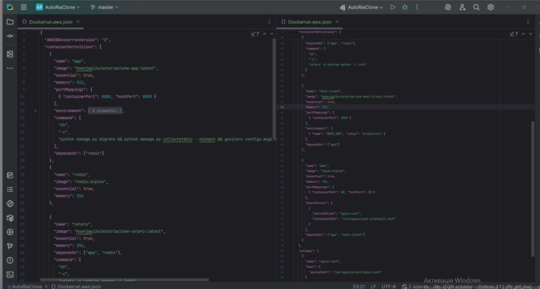
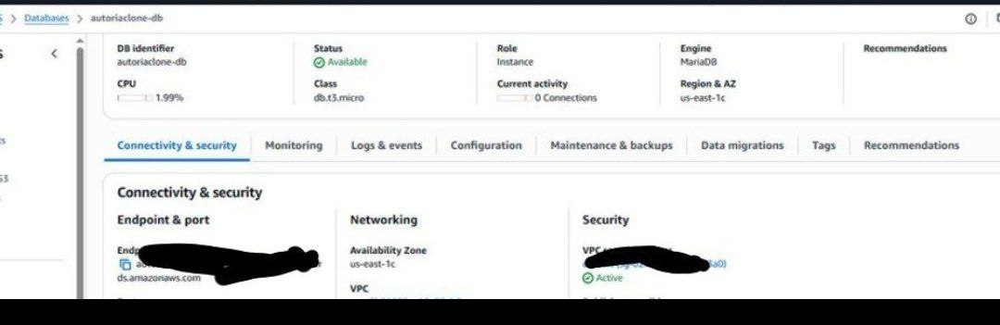
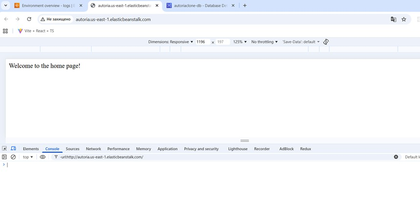

🌟 AutoRia Clone Platform 🌟
Welcome to the AutoRia Clone platform — a scalable, modern solution for buying and selling cars. It’s designed to be highly flexible and ready for deployment to AWS with seamless scaling.
🔑 Key Features 🔑

🧑‍🤝‍🧑 Roles
The platform supports four distinct user roles, each with different permissions:
Buyer: A user browsing the platform who can contact sellers or dealerships for test drives or viewings.
If a Buyer is logged in, they have access to the chat on the page of the car they are interested in.

Seller: A user who wants to sell a car.
A Seller can contact different potential Buyers in the Chat. A private Chat is also available by clicking on a user.
Unfortunately, the chat could only be implemented by running a separate command:
npm run dev
(ws://localhost/api)

Manager: A user who moderates the platform (e.g., bans users or removes invalid listings).
Admin: A superuser with full access to all features. Only platform owners and partners will have this role.

🔐 Superuser Credentials for Instructor Testing
To verify the functionality of the platform, you can use the following superuser credentials to access the Django admin panel:
Email: admin@gmail.com
Password: 111111

🔐 Admin Credentials (for Instructor Testing)
To verify the functionality of the platform, you need to enter the following value in the settings.py file (the last line).
(I left my own value there.)
MANAGER_EMAIL = ""

🛠️ Account Types
Basic Account: Default account for sellers. This allows posting a single car listing.
Premium Account: Grants unlimited listings and access to advanced statistics, such as views per day/week/month and regional price averages.

🚗 Core Features
Car Listings
Sellers can list cars with details such as the brand, model, price (in USD, EUR, UAH), and region.
Basic accounts: Limit to one car listing.
Premium accounts: Unlimited car listings.
Currency Conversion: Car prices are automatically converted using the PrivatBank exchange rate and updated daily.
If inappropriate words are found, sellers will be prompted to edit the listing (up to 3 attempts).
After 3 failed attempts, the listing becomes inactive and the Manager receives an email notification about it.
Listing Statistics (Premium Only)
Premium users can view the following detailed statistics for their listings:
Views per day, week, and month.
Average car price by region (e.g., Kyiv, Lviv).
National average price for cars.

🏗🏗️ System Architecture with WebSocket
The system is designed for scalability and flexibility, using Docker for containerization and ready for deployment on AWS. The architecture includes the following components:
Backend (Django): Handles car listings, user management, and statistics.
Frontend (Next.js): User interface for browsing listings and managing accounts.
Database (Supabase / PostgreSQL): Stores all user and car listing data.
Redis: Used for caching and task management via Celery.
Celery: Handles asynchronous background tasks.
Nginx: Reverse proxy managing incoming requests.
Docker: Containerization of all components for easy deployment and scaling.
WebSocket: Provides real-time chat between Sellers and Buyers, including private messaging.

🎨 Frontend / UI & Design
### Styling
All components use **CSS Modules** for scoped and maintainable styles.

### Animations
**GSAP** provides smooth and interactive animations for Home Page

### Layout / Responsiveness
A **mixed responsive layout** (Flex + media queries + relative units) ensures proper display on all devices.

🛠️ Setup and Installation
1. Clone the Repository
git clone https://github.com/OksanaMosk/AutoRiaClone.git
cd AutoRiaClone

2. Install Backend Dependencies (Django)
Create a virtual environment or
for a quick verification, please use my .env file.

cd backend
python -m venv venv
You can activate the virtual environment.
venv\Scripts\activate

Install dependencies
poetry install

3. Install Frontend Dependencies (Next.js)
cd next-client
npm install

4. Set Up the Database
The project supports Supabase / PostgreSQL.
Ensure your database is running.

Run migrations:
cd backend
python manage.py migrate

I know this shouldn’t be done, but I don’t mind, for a quick real-time check of the project.
email:ksenjap124@gmail.com
password: Ksenjap124@gmail.com
(Table Editor)

5. Run the Project Locally
Use Docker Compose to run all services:
docker-compose build
docker-compose up
Backend (Django): http://localhost:8000
Alternative port (for Docker / dev): http://localhost:8888
Frontend (Next.js): http://localhost:3000
WebSocket chat
WebSocket host: ws://localhost/api

6. Superuser for Testing
Django admin credentials for testing:
Email: admin@gmail.com
Password: 111111
Or create your own superuser:
python manage.py createsuperuser

Additional Notes
Redis is required for Celery tasks.
All components (Backend, Frontrend, Redis, Celery, Nginx) are containerized with Docker.
For production, configure environment variables and Docker/Nginx as needed.

🐳 Docker Containers
This project includes the following Docker containers:
Backend (Django): For the API service.
Frontend (Next.js): For the user interface.
Database Supabase / PostgreSQL: For storing data.
Redis: For task management.
Celery: For asynchronous background tasks.
Nginx: For serving static files and acting as a reverse proxy.
To build and run the containers locally:
docker-compose build
docker-compose up

📑 API Endpoints
Here are some of the core API endpoints for the AutoRia Clone project.

Auth Endpoints

Register
POST /auth/register/
Registers a new user.

Login
POST /auth/login/
Logs in a user and provides a token.

Refresh Token
POST /auth/refresh/
Refreshes the authentication token.

Me
GET /auth/me/
Returns the current logged-in user's information.

Activate (GET)
GET /auth/activate/{token}/
Activates a user account using a token.

Activate (PATCH)
PATCH /auth/activate/{token}/
Activates a user account using a token (PATCH request).

Recovery
POST /auth/recovery/
Initiates the password recovery process.

Recovery Confirm
POST /auth/recovery/{token}/
Confirms the password recovery using the provided token.

Cars Endpoints

List Cars
GET /cars/
Retrieves a list of all cars.

Create Car
POST /cars/
Creates a new car listing.

Car Constants
GET /cars/constants/
Retrieves the constants for car brands, models, and other static data.

Exchange Rates
GET /cars/exchange-rates/
Returns the latest exchange rates for car price conversion.

Delete Car Photo
DELETE /cars/photos/{id}/
Deletes a photo from a car listing.

Stats Country
GET /cars/stats/average-country/
Retrieves average car prices by country.

Stats Average
GET /cars/stats/average/
Retrieves the average price of cars across all listings.

Upload Photo
POST /cars/{car_id}/photos/
Uploads a new photo for a car listing.

Car Stats
GET /cars/{car_id}/stats/
Retrieves statistics for a specific car listing.

Get Car
GET /cars/{id}/
Retrieves detailed information about a specific car listing.

Update Car (PUT)
PUT /cars/{id}/
Updates a car listing with new information.

Update Car (PATCH)
PATCH /cars/{id}/
Partially updates a car listing with new information.

Delete Car
DELETE /cars/{id}/
Deletes a car listing.

Users Endpoints

List Users
GET /users/
Retrieves a list of all users.

Create User
POST /users/
Creates a new user.

Change Account Type
PATCH /users/change-account-type/{user_id}/
Changes the account type (e.g., from Basic to Premium) of a user.

Change Role
PATCH /users/change-role/{user_id}/
Changes the role (e.g., Admin, Manager) of a user.

Get Block Status
GET /users/{id}/block/
Retrieves the block status of a user.

Block User
PUT /users/{id}/block/
Blocks a user from the platform.

Block User (PATCH)
PATCH /users/{id}/block/
Updates the block status of a user.

Delete User
DELETE /users/{id}/delete/
Deletes a user from the platform.

Read User Update Info
GET /users/{id}/update/
Retrieves information about pending updates for a user.

Update User (PUT)
PUT /users/{id}/update/
Updates user information with the provided details.

Update User (PATCH)
PATCH /users/{id}/update/
Partially updates user information.

User Cars
GET /users/{user_id}/cars/
Retrieves a list of cars listed by a specific user.

Change Dealership
PATCH /users/{user_id}/change-dealership/

📦 Postman Collection
The Postman collection for API testing can be found in the /postman directory. This collection contains sample API requests for easy testing and development.
How to Import the Postman Collection:
Open Postman.
Go to File > Import.
Select Import From Link and paste the URL to the Postman collection JSON file.

🌱 Additional Notes
Scalable Architecture: The platform is built with scalability in mind, allowing for future growth and additional features.
Future Extensions: The system supports the addition of car dealerships and their associated roles (managers, admins, etc.).
Customization: The platform's modular architecture allows for future features and third-party integrations.
This documentation provides a high-level overview of the AutoRia Clone platform. For more detailed usage, refer to the Postman collection or explore the API directly.

Additional Notes
The platform is modular, allowing for future extension and the addition of new roles, features, and third-party integrations.
The system is built for scalability, ensuring it can handle a growing user base with ease.
The architecture supports future changes like adding car dealerships and their associated roles (managers, admins, etc.).

☁️ AWS Deployment (Elastic Beanstalk)
I used Dockerrun.aws.json , along with Gunicorn and an RDS MariaDB  instance.
During deployment to AWS Elastic Beanstalk:
No critical errors were reported in the system logs [AWS](./screenshots/aws.jpg).
However, the Next.js client did not render correctly, showing only the default backend page "Welcome to the home page!"
.
Due to limited time and unstable electricity, the deployment was reverted to a local setup to ensure the project could be fully tested and reviewed.
The project can be reviewed locally using Docker without issues.
Future plans include successfully deploying the project to AWS.
Relevant screenshots are attached.
